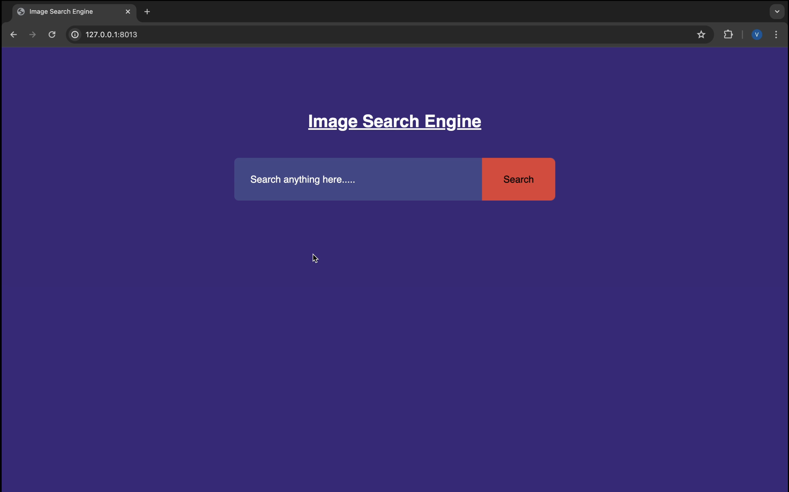

# Image_Captioning_Using_ML

TThis project implements a basic image search engine with captions, upload images, search by image and retrieve descriptive captions generated by an advanced image captioning model. The application is built using FastAPI for the backend and utilizes HTML, CSS, and JavaScript for the frontend. Here’s a short description of its key components and functionality:

## Key Components

### Frontend:

HTML: Provides the structure for the web page, including a file upload form.

CSS: Adds styling to the web page, ensuring it is visually appealing and user-friendly.

JavaScript: Manages form submission, sending the uploaded image to the backend, and displaying the generated caption.

### Backend:

FastAPI: A modern web framework for building APIs with Python, known for its high performance and ease of use.

BLIP (Bootstrapped Language-Image Pre-training) Model: An advanced image captioning model from Salesforce that generates natural language descriptions of images.

Pillow: A Python Imaging Library (PIL) used to handle image processing.

### Image Captioning:

The captions for the images are generated using the BLIP Image Captioning Model.

For each uploaded image, the model processes it and generates a descriptive caption.

Captions are stored in a CSV file along with the corresponding image_id.

### Search Functionality:

The search engine takes a user query as input and compares it with the captions of the images.

Two algorithms are implemented for image retrieval:

Boolean Search: This search uses logical operators (AND, OR, NOT) to match the query with the captions and retrieve relevant images.

Jaccard Similarity Search: This algorithm measures the similarity between the query and captions by computing the intersection and union of words (tokens) in the query and captions, and returning images with the highest similarity scores.

### Result Display:

The most relevant images (based on caption-query matching) are returned to the frontend for display.

The top 30 results are shown to the user with the corresponding image and its generated caption.

## Algorithms and Techniques

BLIP Model: This is used for generating captions for each image uploaded to the system. The captions provide semantic descriptions of the images and are stored for future use in the search process.

Boolean Search: Uses an inverted index created from the captions and performs logical operations like AND, OR, and NOT to retrieve matching images.

Jaccard Similarity: This method compares the query with the captions based on the set intersection and union of words, computing a similarity score. The top results with the highest scores are displayed.

## System Flow
### Image Upload:

When a user uploads an image, a caption is generated using the BLIP model.

The caption is stored along with the image ID in the backend CSV file.

### Image Search:

The user inputs a text query.

The system processes the query and compares it with the stored captions using one of the two algorithms (Boolean search or Jaccard similarity).

Relevant images are returned based on the match and displayed on the frontend.

## Demo Video

Click the image above to watch the demo video.