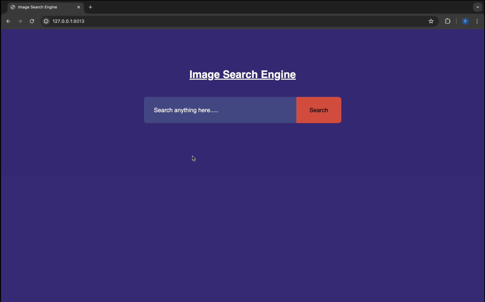
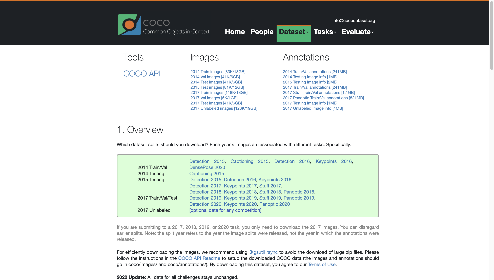

# 🔍 Image Search Engine (Multi-Algorithm)

A full-stack **Image Search Engine** built using **FastAPI + HTML/CSS/JS**, supporting multiple search techniques including **Boolean Search, TF-IDF, BERT embeddings, and Image-based search (BLIP)**.

🌐 **Live Demo:**  
👉 https://vaishnavi230805-image-search-engine.hf.space

## Key Components

### Frontend:

HTML: Provides the structure for the web page, including a file upload form.

CSS: Adds styling to the web page, ensuring it is visually appealing and user-friendly.

JavaScript: Manages form submission, sending the uploaded image to the backend, and displaying the generated caption.

### Backend:

FastAPI: A modern web framework for building APIs with Python, known for its high performance and ease of use.

BLIP (Bootstrapped Language-Image Pre-training) Model: An advanced image captioning model from Salesforce that generates natural language descriptions of images.

Pillow: A Python Imaging Library (PIL) used to handle image processing.

### Image Captioning:

The captions for the images are generated using the BLIP Image Captioning Model.

For each uploaded image, the model processes it and generates a descriptive caption.

Captions are stored in a CSV file along with the corresponding image_id.

### Search Functionality:

The search engine takes a user query as input and compares it with the captions of the images.

Two algorithms are implemented for image retrieval:

Boolean Search: This search uses logical operators (AND, OR, NOT) to match the query with the captions and retrieve relevant images.

Jaccard Similarity Search: This algorithm measures the similarity between the query and captions by computing the intersection and union of words (tokens) in the query and captions, and returning images with the highest similarity scores.

### Result Display:

The most relevant images (based on caption-query matching) are returned to the frontend for display.

The top 30 results are shown to the user with the corresponding image and its generated caption.

## Algorithms and Techniques

Boolean: It builds an inverted index (term to set of caption ids) after lowercasing, removing stopwords and Porter stemming. It parses AND / OR / NOT queries by converting infix to postfix (shunting-yard) and evaluates them with set intersection, union and complement.

TF-IDF: It uses sklearn's TfidfVectorizer (sublinear TF, 5,000 features) and ranks captions by cosine similarity, returning the top 15.

BERT with cosine similarity: It embeds the query and compares it to every caption vector, returning the top 15.

BERT with dot product: This is the same idea but ranks by raw dot product, so I would expect it to favour vectors with larger norms.

## System Flow
### Image Upload:

When a user uploads an image, a caption is generated using the BLIP model.

The caption is stored along with the image ID in the backend CSV file.

### Image Search:

The user inputs a text query.

The system processes the query and compares it with the stored captions using one of the two algorithms (Boolean search or Jaccard similarity).

Relevant images are returned based on the match and displayed on the frontend.


## Demo Video

[](media/video_demo.mp4)

Click the image above to watch the demo video.

## How to run the file

### Step 1: Download Dataset

Go to the website [Coco Dataset](https://cocodataset.org/#home) 

(Dataset --> Downloads --> 2017 Train images [118K/18GB])

Download these dataset of images


Keep the dataset in static folder.

### Step 2: Generate the caption of dataset
To generate the caption run main.ipynb file and the your captions is generated and it will be saved in the caption.csv file 

### Step 3: Run command
``` 
cd Image_Captioning_Using_ML
```

```
uvicorn main:app --reload --port 8001
```
You can choose any port.

NOTE: For BERT Model implementation 
Firstly run the code in main.ipynb file (which generate a npy file)
